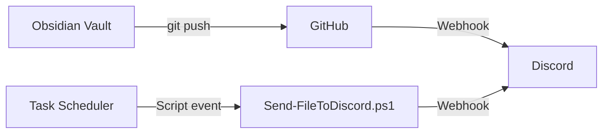

# Automation Roadmap

## 1. Discord Integration (Issue #8)

### Goal
Sync Obsidian events to Discord.

### Implementation Plan

| Phase | Task | Status |
|-------|------|--------|
| Phase 1 | Discord webhook sender script | ✅ Done (`Technical/Scripts/Discord/Send-FileToDiscord.ps1`) |
| Phase 2 | Define notification events | 🔲 Pending |
| Phase 3 | Integrate with git hooks | 🔲 Pending |
| Phase 4 | Rate limiting & retry | 🔲 Pending |

### Planned Events

| Event | Channel | Priority |
|-------|---------|----------|
| Git push / commit | #git-activity | Low |
| Snapshot created | #backup | Low |
| Vault error / crash | #alerts | High |
| Encoding damage detected | #alerts | High |
| Script failure | #alerts | High |

### Architecture

---

## 2. Graph Update Automation

### Current State
- 16+ graph systems, each with its own generator
- Generators are `.py` and `.ps1` scripts in `Zetl/`
- `generate_all_graphs.py` orchestrates batch generation
- No incremental updates — full rebuild only

### Roadmap

| Phase | Task | Status |
|-------|------|--------|
| 1 | Consolidate duplicate generators (14 versions of `generate_personality_map*.ps1` → 1) | 🔲 Pending |
| 2 | Standardize generator interface (input/output contract) | 🔲 Pending |
| 3 | Add change detection (skip unchanged graphs) | 🔲 Pending |
| 4 | Add parallel graph generation | 🔲 Pending |
| 5 | Add generation log + error reporting | 🔲 Pending |
| 6 | Integrate with git pre-commit hook | 🔲 Pending |
| 7 | Schedule weekly full regeneration via Task Scheduler | 🔲 Pending |

### Generator Consolidation Plan

| Current | Target | Action |
|---------|--------|--------|
| 14 `generate_personality_map_final*.ps1` | 1 `generate_personality_map.ps1` | Consolidate |
| `KnowledgeGraphs/` + `KnowledgeGraphs_Core/` | `KnowledgeGraphs/` | Merge duplicates |
| Separate `generate_knowledge_graph.py v1/v2/v3` | 1 `generate_knowledge_graph.py` | Consolidate |

---

## 3. Script Management

### Canonical Locations

| Script Type | Canonical Path | Status |
|-------------|---------------|--------|
| Git automation | `Technical/Scripts/Git/` | ✅ Done |
| Vault maintenance | `Technical/Scripts/Vault/` | ✅ Done |
| Obsidian plugins | `Technical/Scripts/Obsidian/` | ✅ Done |
| Launchers (VBS) | `Technical/Scripts/Launchers/` | ✅ Done |
| Graph generators | `Zetl/<graph>/generate.*` | ⚠️ In progress |
| Discord | `Technical/Scripts/Discord/` | ✅ Done |

### Cleanup Done
- ✅ Removed legacy scripts from `Старое/`
- ✅ Consolidated `hourly-git.ps1` and `daily-git.ps1` into `daily-push.ps1`
- ✅ Fixed all Task Scheduler paths (with/without `Technical/` prefix)
- ✅ Created missing `run-hourly.vbs`
- ✅ Removed stale lock files

### Pending Cleanup
- 🔲 Consolidate 14 versions of `generate_personality_map*.ps1`
- 🔲 Merge `KnowledgeGraphs_Core` into `KnowledgeGraphs`
- 🔲 Remove empty directories (26+ empty dirs across vault)
- 🔲 Archive or delete `Старое/`

---

## 4. Vault Maintenance Automation

| Task | Script | Frequency | Status |
|------|--------|-----------|--------|
| Auto-commit | `vault/auto-commit.ps1` | 1h | ✅ Working |
| Auto-push | `Technical/Scripts/Git/daily-push.ps1` | 1s/5min | ✅ Working |
| Snapshot | `vault/snapshot.ps1` | 6h | ✅ Working |
| GC | `vault/gc.ps1` | Weekly | ✅ Working |
| Kanban move tasks | `Technical/Scripts/Vault/Move-TodayTasks.ps1` | Daily | ✅ Fixed |
| Kanban watcher | `Technical/Scripts/Launchers/run-watcher.vbs` | Continuous | ✅ Fixed |
| Encoding check | Custom hook | Per commit | ✅ Done |
| Tag validation | 🔲 Pending | Weekly | 🔲 |
| Broken link scan | 🔲 Pending | Monthly | 🔲 |
