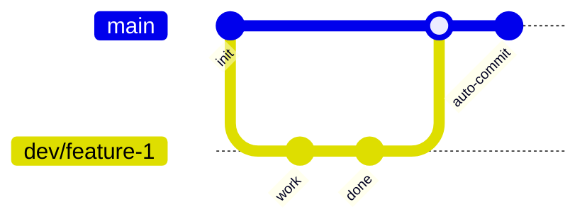
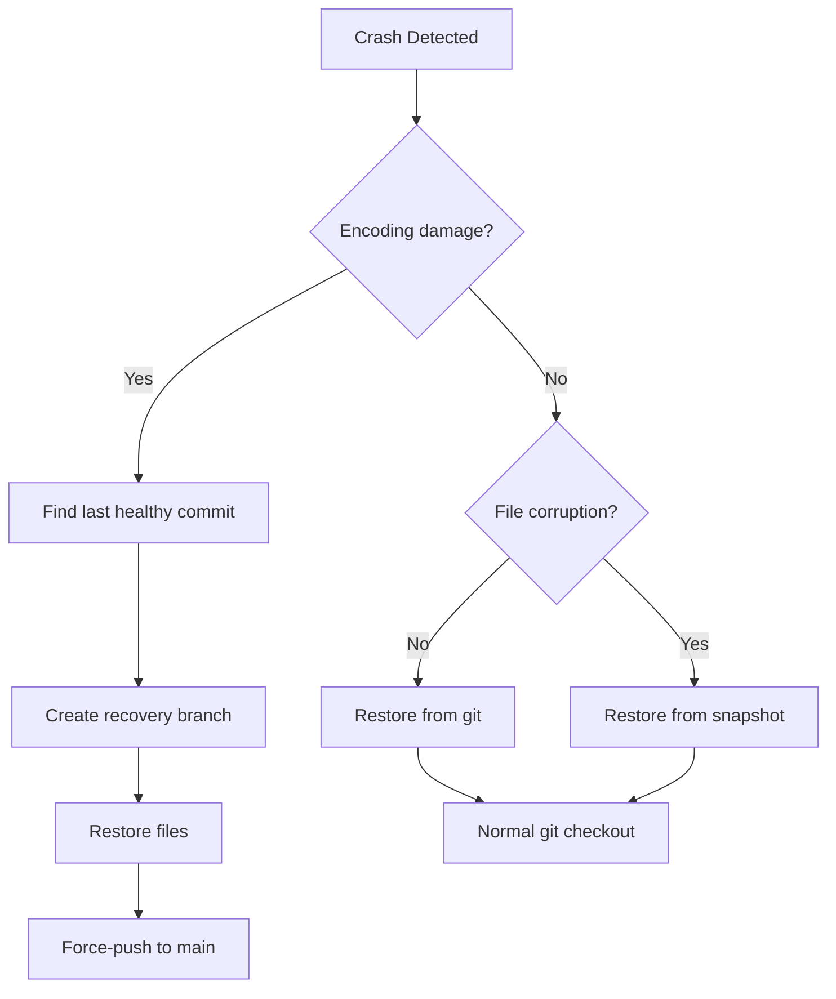

# DevOps Architecture — Obsidian Vault + Graph System

## Overview

Architecture for a single-developer Obsidian vault (GitHub-hosted) with 235K+ files, 89 scripts, and 16+ generated graph systems. Designed for maintainability, recovery, and gradual automation.

---

## 1. Repository Structure

```
ObsiduanMain/
├── .github/                  # GitHub Actions, templates
├── Angl/                     # English learning notes
├── Life/                     # Life system notes
├── Technical/                # *** DEV CENTER ***
│   ├── Docs/                 # Architecture, roadmaps, runbooks
│   ├── Scripts/
│   │   ├── Discord/          # Discord integration
│   │   ├── Git/              # Git automation (daily-push)
│   │   ├── Launchers/        # VBS wrappers for Task Scheduler
│   │   ├── Logs/             # Execution logs
│   │   ├── Obsidian/         # Obsidian plugin helpers
│   │   ├── Rendering/        # Graph rendering scripts
│   │   └── Vault/            # Vault maintenance (Move-TodayTasks, etc.)
│   ├── Tests/                # Script tests
│   └── vault/                # Obsidian vault config backup
├── Zetl/                     # Graph systems (KnowledgeGraphs, etc.)
├── vault/                    # Obsidian vault (auto-commit + auto-push)
├── Старое/                   # Legacy archive (>200K files)
├── .gitignore
├── SECURITY.md
└── README.md
```

### Directory Rules
| Directory | Git | Backup | Description |
|-----------|-----|--------|-------------|
| `Technical/` | ✅ Yes | ✅ Yes | Dev artifacts, scripts, docs |
| `Zetl/` | ✅ Yes | ✅ Yes | Generated graphs (source + output) |
| `vault/` | ✅ Yes | ✅ Yes | Active Obsidian vault |
| `Старое/` | ❌ No | ⚠️ Archive | Legacy copy, not synced |
| `.github/` | ✅ Yes | ✅ Yes | CI/CD workflows |
| Logs | ❌ No (.gitignore) | ❌ No | Ephemeral |

---

## 2. Branching Strategy

| Branch | Purpose | Created By | Protection |
|--------|---------|------------|------------|
| `main` | Source of truth, auto-deploy | — | No direct push, signed commits |
| `dev/*` | Feature development | Developer | None |
| `fix/*` | Bug fixes | Developer | None |
| `experiment/*` | Spikes, experiments | Developer | None |
| `recovery-*` | Emergency recovery | Developer | Temporary |

### Workflow



Single developer → no complex branching needed. All work goes through `main`. Recovery branches are temporary.

---

## 3. CI/CD Pipeline

### Continuous Integration (GitHub Actions)

```yaml
name: Vault CI
on: [push]
jobs:
  validate:
    runs-on: ubuntu-latest
    steps:
      - uses: actions/checkout@v4
      - name: Check broken links
        run: grep -r "\[\[.*\]\]" --include="*.md" | grep -v "^.*:.*\[\[.*\]\].*$" || true
      - name: Validate frontmatter
        run: python Technical/Scripts/validate_frontmatter.py
      - name: Check encoding (UTF-8)
        run: python Technical/Scripts/check_encoding.py
```

### Continuous Delivery

| Environment | Trigger | Action |
|-------------|---------|--------|
| `main` | Push | Auto-commit + push to GitHub |
| GitHub | Push | CI validation |
| Local | Daily | VaultAutoCommit + VaultSnapshot |

---

## 4. Git Automation

### Current Implementation

| Script | Interval | Function |
|--------|----------|----------|
| `daily-push.ps1` | Commit: 1s, Push: 5min | Auto-commit + push loop |
| `threshold-git.ps1` | 15s | Threshold-based commit |
| `monitor-daily-push.ps1` | 1min | Health check |
| `auto-commit.ps1` | 1h (vault/) | Obsidian vault auto-commit |
| `gc.ps1` | Weekly | Git garbage collection |
| `snapshot.ps1` | 6h | Vault snapshot |

### Task Scheduler Health

| Task | Status | Script Path |
|------|--------|-------------|
| VaultAutoCommit | ✅ OK | `vault\auto-commit.ps1` |
| VaultSnapshot | ✅ OK | `vault\snapshot.ps1` |
| VaultGC | ✅ OK | `vault\gc.ps1` |
| HourlyGit | ✅ Fixed | `Technical\Scripts\Launchers\run-hourly.vbs` |
| DailyPush | ✅ Fixed | `Technical\Scripts\Git\daily-push.ps1` |

---

## 5. Recovery Strategy

### Principles
1. **Git is source of truth** — every commit is a recovery point
2. **Snapshots** — `snapshot.ps1` creates `vault/snapshots/` every 6h
3. **Recovery branches** — `recovery-<date>` for emergency fixes
4. **Pre-commit hook** — blocks `?` encoding damage

### Recovery Flow


---

## 6. Infrastructure as Code

All automation is stored as PowerShell scripts under `Technical/Scripts/`. No Kubernetes, no Docker — single-machine Obsidian vault.

### Script Categories

| Category | Count | Location |
|----------|-------|----------|
| Git automation | 6 | `Technical/Scripts/Git/` |
| Vault maintenance | 11 | `Technical/Scripts/Vault/` |
| Obsidian | 3 | `Technical/Scripts/Obsidian/` |
| Discord | 1 | `Technical/Scripts/Discord/` |
| Launchers | 3 | `Technical/Scripts/Launchers/` |
| Tests | 2 | `Technical/Tests/` |

---

## 7. Security Architecture

| Measure | Status |
|---------|--------|
| Commit signing | ❌ Not configured |
| Secret scanning | ❌ Not configured |
| Branch protection | ❌ Single developer |
| SBOM | ❌ Not applicable |
| Least privilege | ✅ Single user account |

---

## 8. Monitoring

| What | How | Frequency |
|------|-----|-----------|
| Git push success | `daily-push.ps1` log | Real-time |
| Task Scheduler health | Manual check | Weekly |
| Vault file count | `scripts/VaultHelpers.ps1` | Weekly |
| Encoding integrity | grep `?` patterns | Per commit |
